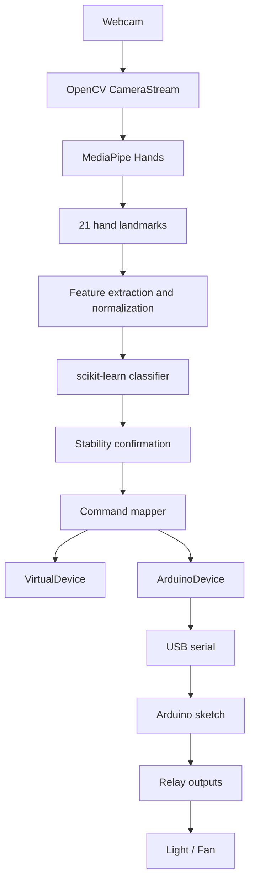

# Gesture Recognition with Virtual & Physical IoT Control

A real-time, offline static hand-gesture recognition application built with Python, OpenCV, MediaPipe, and scikit-learn. It reads a laptop webcam stream, detects one hand, converts its landmarks into normalized features, recognizes a gesture with a trained machine-learning model, and turns the confirmed result into virtual or Arduino USB-serial IoT control commands.

The project demonstrates an end-to-end Computer Vision and Machine Learning pipeline with a clean AI-to-device command layer. It runs locally without cloud services, MQTT, Wi-Fi, or internet-based APIs.

## Features

- Real-time webcam input with OpenCV.
- MediaPipe Hands landmark detection and on-screen landmark drawing.
- Four static hand gestures mapped to light/fan commands.
- Landmark-based ML classification with calibrated confidence scores.
- Translation, in-plane rotation, and scale-normalized features.
- Consecutive-frame confirmation and a confidence threshold to reduce accidental commands.
- Virtual light/fan simulation and optional Arduino USB-serial device communication.
- Optional low-light detector-input enhancement using CLAHE and conditional gamma brightening.
- Interactive CSV data collection and reproducible model training workflow.
- Automated non-camera tests for core pipeline behavior and error cases.

## Supported gestures

| Gesture | Command | Virtual device effect |
| --- | --- | --- |
| Open Palm | `LIGHT_ON` | Turns the virtual light on |
| Fist | `LIGHT_OFF` | Turns the virtual light off |
| Thumbs Up | `FAN_ON` | Turns the virtual fan on |
| Peace Sign | `FAN_OFF` | Turns the virtual fan off |

## How it works

```text
Webcam
  → CameraStream
  → optional low-light preprocessing
  → MediaPipe Hands (one hand, 21 landmarks)
  → normalized 63-value landmark features
  → trained scikit-learn classifier
  → confidence gate + consecutive-frame stabilizer
  → gesture-to-command mapper
  → selected device (`VirtualDevice` or `ArduinoDevice`)
  → OpenCV display of landmarks, prediction, and light/fan state
```

Only a confident gesture confirmed across five consecutive frames is allowed to reach the command layer. Landmark detection and drawing happen independently of this command-confirmation step.

## Architecture



| Layer | Responsibility |
| --- | --- |
| Camera | Opens, reads, and releases the webcam. |
| Vision | Detects and draws MediaPipe hand landmarks; optionally enhances only the detector input in low light. |
| Recognition | Extracts features, loads the saved model, predicts labels/confidence, and confirms stable predictions. |
| Commands | Maps a confirmed gesture label to a device-independent command. |
| Devices | Applies commands to either the in-memory virtual device or an Arduino USB-serial device. |
| Application | Wires the layers together and renders the OpenCV interface. |

## Technologies used

- Python 3.11
- OpenCV (`opencv-contrib-python`) for webcam access and UI rendering
- MediaPipe Hands for 21-point hand landmark detection
- NumPy for landmark processing
- scikit-learn for preprocessing, SVM classification, probability calibration, data splitting, and evaluation
- pyserial for optional local Arduino USB-serial communication
- CSV for the labeled landmark dataset
- Python `pickle` for the saved trained model
- Python `unittest` for automated tests

## Machine Learning approach

This project uses landmark-based classical machine learning—not image-based deep learning and not rule-based gesture detection.

- **Input:** 21 MediaPipe landmarks with `x`, `y`, and `z` coordinates.
- **Features:** 63 values (`21 × 3`). Coordinates are made wrist-relative, rotated so the wrist-to-middle-finger-base direction is consistent, and scale-normalized.
- **Training data:** the CSV contains user-collected landmark samples for all four gesture labels.
- **Augmentation:** each training feature vector is mirrored to help the classifier support both hand sides. Validation and held-out test rows are not mirrored.
- **Model:** a `StandardScaler` followed by an RBF-kernel `SVC`, wrapped in `CalibratedClassifierCV` to produce confidence probabilities.
- **Evaluation:** the training command uses stratified 60%/20%/20% train/validation/test splits and prints validation accuracy, held-out test accuracy, a classification report, and a confusion matrix for the current dataset.

The repository includes a saved model and a 1,365-row CSV dataset. Dataset quality and measured metrics remain specific to the collected samples; run training again after collecting additional data to evaluate any updated model.

## Project structure

```text
gesture-recognition-project/
├── app.py                         # Integrated webcam application
├── config.py                      # Runtime paths, thresholds, and feature toggles
├── requirements.txt               # Pinned Python dependencies
├── data/
│   └── gestures.csv               # Labeled 63-feature gesture dataset
├── models/
│   └── gesture_model.pkl          # Saved scikit-learn model
├── hardware/arduino/gesture_iot_controller/
│   └── gesture_iot_controller.ino # Arduino relay-controller sketch
├── scripts/
│   └── test_arduino.py            # Standalone Arduino serial command test
├── src/
│   ├── camera/
│   │   └── camera_stream.py       # Webcam lifecycle wrapper
│   ├── vision/
│   │   ├── hand_landmarks.py      # MediaPipe Hands wrapper
│   │   └── preprocessing.py       # Low-light detection preprocessing
│   ├── recognition/
│   │   ├── features.py            # Feature normalization and mirroring
│   │   ├── classifier.py          # Saved-model inference wrapper
│   │   ├── stability.py           # Consecutive-frame confirmation
│   │   ├── collect_data.py        # Interactive CSV sample collector
│   │   └── train_model.py         # Training and evaluation pipeline
│   ├── commands/
│   │   └── command_mapper.py      # Gesture-to-command mapping
│   └── devices/
│       ├── virtual_device.py      # Device interface and virtual light/fan
│       └── arduino_device.py      # Arduino USB-serial device implementation
└── tests/
    ├── test_stage11.py            # Existing non-camera pipeline tests
    └── test_arduino_device.py     # Mocked Arduino serial tests
```

## Requirements

- Windows with a webcam
- Python 3.11
- The packages pinned in `requirements.txt`

## Setup

From the project root in PowerShell:

```powershell
python -m venv .venv
.\.venv\Scripts\Activate.ps1
python -m pip install -r requirements.txt
```

If PowerShell blocks environment activation for the current terminal session:

```powershell
Set-ExecutionPolicy -Scope Process -ExecutionPolicy Bypass
```

Then activate the environment again:

```powershell
.\.venv\Scripts\Activate.ps1
```

## Run the application

```powershell
python app.py
```

Place one hand in the webcam view. The window shows detected landmarks, the raw model prediction, confirmation state, last command, and virtual appliance states. Press `Q` while the camera window is focused to exit.

### Virtual mode

Virtual mode is the default and needs no Arduino hardware:

```powershell
$env:DEVICE_MODE = "virtual"
python app.py
```

## Collect training data

```powershell
python -m src.recognition.collect_data
```

In the collection window:

- Press `1` for Open Palm, `2` for Fist, `3` for Thumbs Up, or `4` for Peace Sign.
- Place a detected hand in the frame and press `S` to append a sample to `data/gestures.csv`.
- Use both hands and vary orientation before saving additional samples.
- Press `Q` to quit.

## Retrain the model

```powershell
python -m src.recognition.train_model
```

This validates the CSV, trains the classifier, evaluates it on validation and held-out test splits, prints the evaluation report, and overwrites `models/gesture_model.pkl`.

## Run tests

```powershell
python -m unittest discover -s tests -v
```

The included suite validates feature normalization, mirroring, model loading/prediction, stability behavior, gesture-command mappings, virtual device transitions, CSV validation, missing/invalid model handling, and camera-open failure handling. It does not require a physical webcam.

## Device-control modes

`VirtualDevice` is a software-only implementation of `DeviceInterface`. It stores separate `light_on` and `fan_on` states in memory and updates them only through mapped commands. This demonstrates the application’s command/device abstraction without physical hardware.

For local Arduino USB-serial mode, connect the Arduino, identify its Windows COM port, and set it before starting the app:

```powershell
$env:DEVICE_MODE = "arduino"
$env:ARDUINO_PORT = "<YOUR_ARDUINO_COM_PORT>"
python app.py
```

The default Arduino baud rate is `9600`. In Arduino mode, a newly confirmed gesture command is sent once as a UTF-8 line, for example `LIGHT_ON\n`; the existing five-frame stability gate prevents frame-by-frame repeat sends. If the Arduino is unavailable, the app reports the serial error and continues rather than crashing.

`hardware/arduino/gesture_iot_controller/gesture_iot_controller.ino` receives `LIGHT_ON`, `LIGHT_OFF`, `FAN_ON`, and `FAN_OFF` over USB serial and controls separate light/fan relay pins. The sketch includes `RELAY_ACTIVE_HIGH`; the hardware team must set it according to the actual relay module. Physical Arduino/relay hardware has not been tested by this repository.

### Arduino command protocol

At `9600` baud, the application sends one newline-terminated UTF-8 command only when the existing stability gate newly confirms a gesture:

```text
LIGHT_ON
LIGHT_OFF
FAN_ON
FAN_OFF
```

To test the serial relay controller without the webcam/ML application:

```powershell
python scripts/test_arduino.py LIGHT_ON --port <YOUR_ARDUINO_COM_PORT>
python scripts/test_arduino.py LIGHT_OFF --port <YOUR_ARDUINO_COM_PORT>
python scripts/test_arduino.py FAN_ON --port <YOUR_ARDUINO_COM_PORT>
python scripts/test_arduino.py FAN_OFF --port <YOUR_ARDUINO_COM_PORT>
```

No MQTT, cloud service, Wi-Fi dependency, or physical device test is implemented.

## Electrical safety

This prototype should be tested first with low-voltage DC loads. Mains electrical wiring and relay installation must be performed only by qualified or appropriately supervised personnel.

## Low-light enhancement

Before MediaPipe detection, the app can enhance the **detector input only** using CLAHE on the LAB lightness channel and conditional gamma brightening for dark frames. The original webcam frame is still displayed to the user, while detected landmarks are drawn on it.

The behavior is controlled in `config.py`:

```python
ENABLE_LOW_LIGHT_ENHANCEMENT = True
```

Set it to `False` to compare the application without this preprocessing.

## Known limitations

- Recognizes one hand and four static gestures only.
- Very dark lighting can still prevent reliable hand acquisition, even with preprocessing.
- Occlusion, rapid motion, and unusual hand orientations can reduce landmark detection or recognition reliability.
- The dataset is user-collected and class counts are not fully balanced; results should not be generalized beyond the collected data without broader testing.
- Physical Arduino/relay behavior depends on the connected hardware, COM-port selection, wiring, and relay active-level configuration; it has not been tested here.
- The saved model is a Python pickle and should be treated as trusted local content.

## Future improvements

- Collect a larger, more balanced dataset across additional users, backgrounds, lighting conditions, distances, and orientations.
- Add more static gestures or support dynamic gesture sequences.
- Evaluate multi-hand interaction where project requirements call for it.
- Test and document the Arduino/relay wiring with the hardware team.
- Add other hardware-backed `DeviceInterface` implementations only if a different device platform is required.
- Consider a Raspberry Pi standalone deployment or additional sensors only if a future deployment requires them.

## Project status

Completed and ready for local demonstration in virtual mode, with an Arduino USB-serial integration prepared for hardware-team validation. The repository includes the trained model, labeled dataset, setup instructions, and automated non-camera tests needed to reproduce the software workflow.
